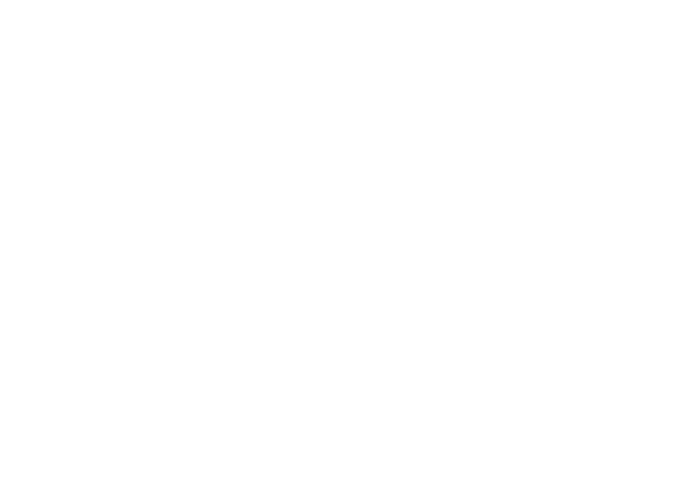

# DeltaX

The unified platform that connects your stack, automates complexity, and scales with your ambition. Build production-ready apps in minutes.



## Features

- **Intelligent Workflows** - Automate complex processes with AI-powered orchestration
- **Unified Stack** - Connect all your tools in one seamless platform
- **Scale Ready** - From prototype to production without rewrites
- **Modern Architecture** - Built on Next.js 16, React 19, and Tailwind CSS 4

## Tech Stack

- **Framework**: [Next.js 16](https://nextjs.org/) with App Router
- **Language**: [TypeScript](https://www.typescriptlang.org/)
- **Styling**: [Tailwind CSS 4](https://tailwindcss.com/)
- **UI Components**: [Radix UI](https://www.radix-ui.com/) + [shadcn/ui](https://ui.shadcn.com/)
- **Icons**: [Lucide React](https://lucide.dev/)
- **Animations**: CSS + Framer Motion ready
- **Analytics**: [Vercel Analytics](https://vercel.com/analytics)

## Getting Started

### Prerequisites

- Node.js 20+ 
- npm, yarn, pnpm, or bun

### Installation

1. Clone the repository:
```bash
git clone https://github.com/deltax-team/deltax-website.git
cd deltax-website/Codebase
```

2. Install dependencies:
```bash
npm install
```

3. Copy environment variables:
```bash
cp .env.example .env.local
```

4. Start the development server:
```bash
npm run dev
```

Open [http://localhost:3000](http://localhost:3000) in your browser.

### Docker Setup

See [Infra/README.md](Infra/README.md) for Docker setup instructions.

## Project Structure

```
Codebase/
├── app/                 # Next.js App Router pages
│   ├── page.tsx        # Homepage
│   ├── about/          # About page
│   ├── contact/        # Contact page
│   ├── privacy/        # Privacy policy
│   └── terms/          # Terms of service
├── components/          # React components
│   ├── ui/             # shadcn/ui components
│   └── *.tsx           # Page sections
├── hooks/              # Custom React hooks
├── lib/                # Utility functions & data
├── public/             # Static assets
├── styles/             # Global styles
├── Infra/              # Docker & deployment configs
└── Docs/               # Documentation
```

## Development

### Available Scripts

- `npm run dev` - Start development server
- `npm run build` - Build for production
- `npm run start` - Start production server
- `npm run lint` - Run ESLint

### Code Style

- ESLint for linting
- TypeScript strict mode enabled
- Tailwind CSS for styling
- Component-based architecture

## Deployment

This project is optimized for deployment on [Vercel](https://vercel.com):

[](https://vercel.com/new/clone?repository-url=https://github.com/deltax-team/deltax-website)

## Contributing

Please read [CONTRIBUTING.md](CONTRIBUTING.md) for contribution guidelines.

## License

This project is licensed under the MIT License - see [LICENSE](LICENSE) for details.

## Contact

- Website: [https://deltax.dev](https://deltax.dev)
- Email: hello@deltax.dev
- Location: Bali, Indonesia

---

Built with by the DeltaX Team
